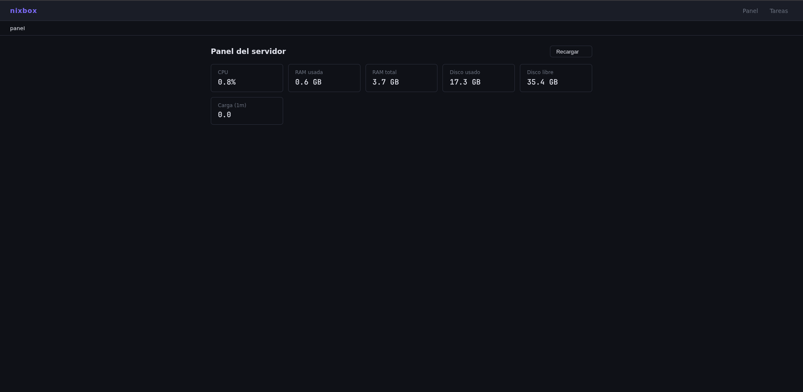
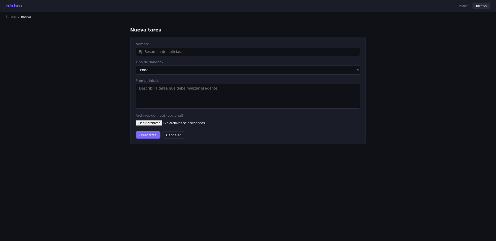
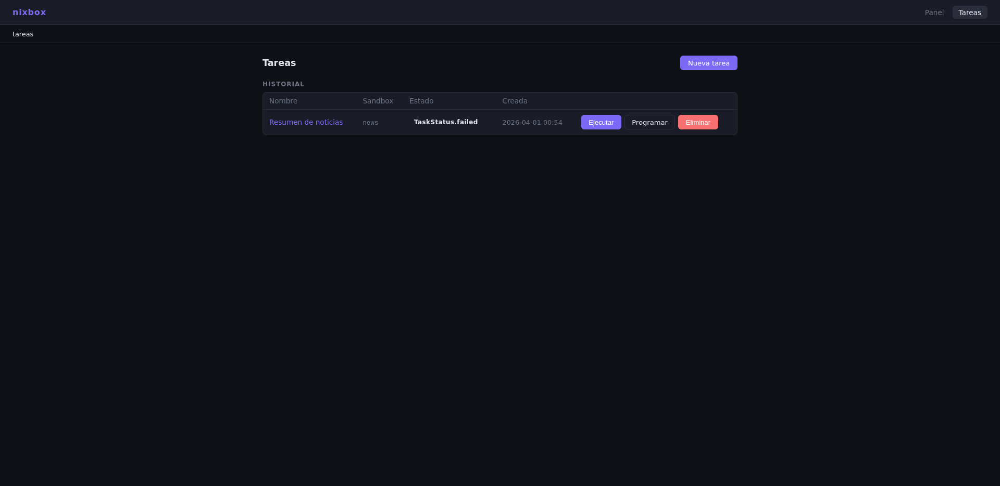
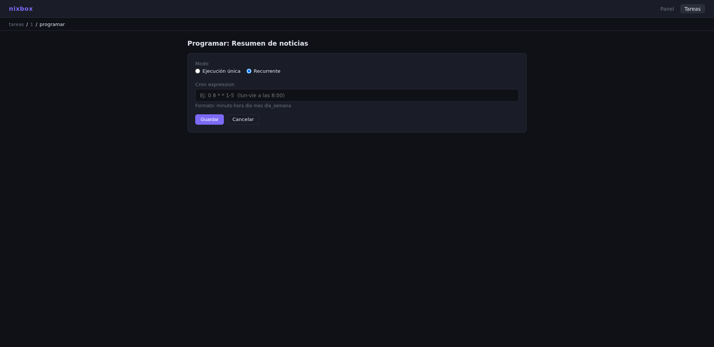

# NixBox

Sistema de gestión de agentes con sandboxing para NixOS. Permite crear y ejecutar tareas automatizadas usando LLMs externos (Anthropic, OpenAI, Google Gemini) desde una interfaz web accesible en tu tailnet.

<div align="center">
    
    
    
    
</div>

## Arquitectura

El sistema se divide en dos capas:

**Layer 1 — UI & Management**: Servidor web FastAPI con interfaz HTMX. Gestiona tareas, programación, inputs/outputs y logs. Corre como servicio systemd bajo un usuario sin privilegios.

**Layer 2 — Orquestación & Ejecución**: Motor de agentes con dos fases. El orquestador genera un plan en Markdown que el usuario debe aprobar antes de que el ejecutor lo lleve a cabo usando herramientas controladas. Las acciones que ejecutan código corren dentro de un sandbox bubblewrap.

```
Usuario → Prompt → Orquestador → Plan → Aprobación → Ejecutor → Acciones → Output
```

## Requisitos

- NixOS con flakes habilitados
- Tailscale configurado
- sops-nix con clave age derivada de SSH ed25519
- Al menos una API key de Anthropic, OpenAI o Google Gemini

## Instalación

### 1. Agregar nixbox como input en tu flake de NixOS

```nix
inputs = {
  nixbox = {
    url = "github:luantorv/nixbox";
    inputs.nixpkgs.follows = "nixpkgs";
  };
};
```

Agregar el módulo a la configuración del servidor:

```nix
modules = [
  nixbox.nixosModules.default
  ./hosts/server/default.nix
];
```

### 2. Agregar las API keys a SOPS

```bash
nix run nixpkgs#sops -- secrets/secrets.yaml
```

Agregar bajo la estructura existente:

```yaml
nixbox:
  tokens: |
    ANTHROPIC_API_KEY=sk-ant-...
    OPENAI_API_KEY=sk-...
    GOOGLE_API_KEY=AI...
```

Solo las claves que tengas disponibles. Las que falten simplemente no registran el proveedor correspondiente.

### 3. Configurar el servicio en NixOS

Crear `hosts/server/nixbox.nix`:

```nix
{ config, pkgs, ... }:

{
  sops.age.sshKeyPaths = [ "/etc/ssh/ssh_host_ed25519_key" ];

  sops.secrets.nixbox-tokens = {
    sopsFile = ../../secrets/secrets.yaml;
    key = "nixbox/tokens";
    owner = "nixbox";
    mode = "0400";
  };

  services.nixbox = {
    enable = true;
    port = 8000;
    tokenFile = config.sops.secrets.nixbox-tokens.path;

    sandboxProfiles = {
      news = {
        orchestratorModel = { provider = "google"; model = "gemini-2.0-flash"; };
        executorModel     = { provider = "google"; model = "gemini-2.0-flash"; };
        allowedDomains    = [ "google.com" "wikipedia.org" "news.ycombinator.com" ];
        allowedActions    = [ "http_get" "write_output" "list_inputs" ];
        allowedLanguages  = [];
      };

      code = {
        orchestratorModel = { provider = "anthropic"; model = "claude-opus-4-5"; };
        executorModel     = { provider = "anthropic"; model = "claude-sonnet-4-5"; };
        allowedDomains    = [ "github.com" "docs.python.org" "pypi.org" "npmjs.com" ];
        allowedActions    = [ "read_input" "write_output" "list_inputs" "http_get" "run_code" "shell" ];
        allowedLanguages  = [ "python" "javascript" ];
      };
    };
  };

  networking.firewall.interfaces."tailscale0".allowedTCPPorts = [ 8000 ];
}
```

Importarlo desde `hosts/server/default.nix`:

```nix
imports = [
  ...
  ./nixbox.nix
];
```

### 4. Rebuild

```bash
sudo nixos-rebuild switch --flake .#server
```

La UI queda disponible en `http://<ip-tailscale>:8000`.

## Perfiles de sandbox

Cada perfil define qué modelo usa el orquestador, qué modelo usa el ejecutor, a qué dominios puede acceder y qué acciones están habilitadas.

### Acciones disponibles

| Acción | Descripción | Sandbox |
|---|---|---|
| `read_input` | Lee archivos de `/inputs` | No |
| `write_output` | Escribe archivos en `/outputs` | No |
| `list_inputs` | Lista archivos disponibles en `/inputs` | No |
| `http_get` | GET HTTP a dominios permitidos | No |
| `run_code` | Ejecuta código Python o JavaScript | bubblewrap |
| `shell` | Ejecuta comandos de una lista blanca | bubblewrap |

### Proveedores soportados

| Provider | Variable de entorno |
|---|---|
| Anthropic | `ANTHROPIC_API_KEY` |
| OpenAI | `OPENAI_API_KEY` |
| Google Gemini | `GOOGLE_API_KEY` |

## Flujo de una tarea

1. Crear tarea en `/tasks/new` seleccionando un perfil y escribiendo el prompt inicial
2. El orquestador genera un plan en Markdown
3. Revisar el plan; aprobar o pedir cambios con feedback
4. Una vez aprobado el ejecutor lleva a cabo el plan paso a paso
5. Los outputs quedan disponibles en `/tasks/{id}/outputs`
6. Los logs completos en `/tasks/{id}/logs`

Las tareas completadas pueden recibir prompts adicionales para continuar, corregir o expandir el trabajo.

## Tareas programadas

Desde `/tasks/{id}/schedule` se puede:

- Programar una ejecución única en una fecha y hora específica
- Configurar una tarea como recurrente usando una cron expression

Ejemplos de cron expressions:
- `0 8 * * 1-5` — lunes a viernes a las 8:00
- `0 */6 * * *` — cada 6 horas
- `0 9 * * 1` — todos los lunes a las 9:00

## Desarrollo

```bash
git clone https://github.com/luantorv/nixbox
cd nixbox
nix develop
```

El devShell incluye todas las dependencias Python y Node.js 22.

## Estructura del repositorio

```
nixbox/
├── flake.nix
├── pyproject.toml
├── layer1/                  # UI & Management (FastAPI)
│   ├── main.py
│   ├── config.py
│   ├── database.py
│   ├── models.py
│   ├── sandbox.py
│   ├── scheduler.py
│   └── templates/
└── layer2/                  # Orquestación & Ejecución
    ├── profile.py
    ├── orchestrator.py
    ├── executor.py
    ├── providers/           # Anthropic, OpenAI, Google
    └── actions/             # files, http, sandbox
```
